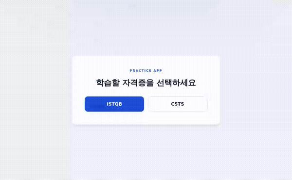
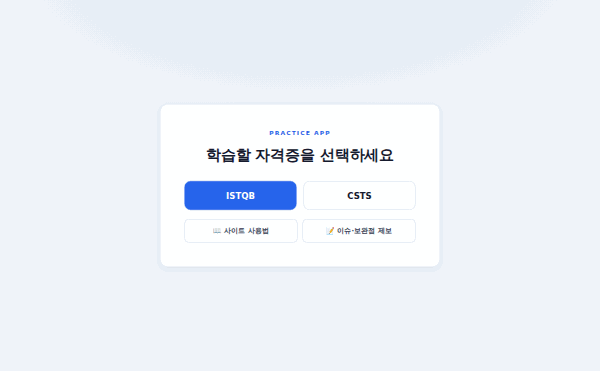
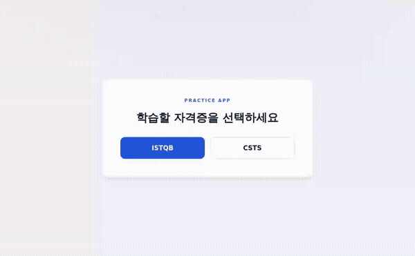
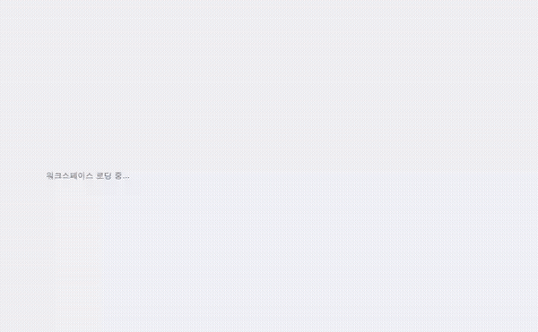
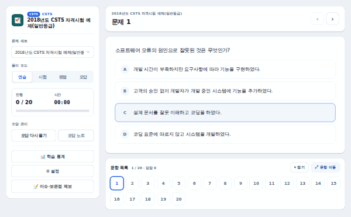
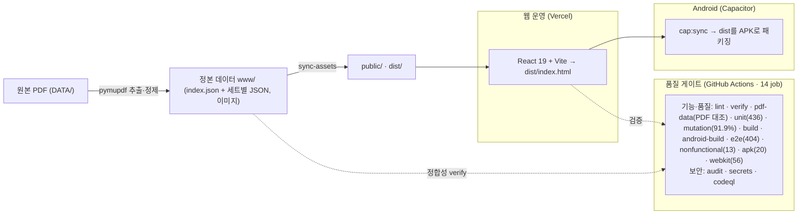

# ISTQB / CSTS 문제 풀이 앱 — 기능 & QA 포트폴리오


-yellow)


ISTQB Foundation Level v4.0 및 CSTS(SW 테스트 전문가) 한국어 기출 **12세트·626문항**을 푸는 오프라인 CBT 문제 풀이 앱입니다.

> **한 줄 요약** — 단순 기능 구현을 넘어 **테스트 자동화(유닛 436 + E2E 437) · 데이터 정합성 검증 ·
> 결함 근본원인 분석(RCA) · CI 품질 게이트**로 품질을 책임진 1인 프로젝트입니다.
> "무엇을 만들었는가"보다 **"품질을 어떻게 보장했는가"** 를 보여주는 사례입니다.

- 저장소: `github.com/WindowHyun/ISTQB`
- 역할: 1인 (기획 · 데이터 · 프론트엔드 · **QA/테스트 자동화 · CI/CD**)
- 데모: 시험 콘텐츠 저작권상 **공개 라이브 배포 대신 스크린샷·GIF·로컬/비공개 데모로 제공** (아래 [데모 자료](#데모-자료-gif--스크린샷) · [라이선스/데모 정책](#라이선스--데이터-저작권--데모-정책) 참고)

---

## 목차

- [하이라이트 (Quality Engineering)](#하이라이트-quality-engineering)
- [QA 역량 매핑](#qa-역량-매핑)
- [주요 기능](#주요-기능)
- [데모 자료 (GIF · 스크린샷)](#데모-자료-gif--스크린샷)
- [테스트 전략](#테스트-전략)
- [테스트 자동화 상세 (E2E 437)](#테스트-자동화-상세-e2e-437)
- [결함 발견 & 근본원인 분석](#결함-발견--근본원인-분석-case-studies)
- [CI 품질 게이트](#ci-품질-게이트)
- [품질 지표](#품질-지표-metrics)
- [아키텍처](#아키텍처)
- [포함된 문제](#포함된-문제)
- [기술 스택](#기술-스택)
- [로컬 실행](#로컬-실행)
- [라이선스 / 데이터 저작권 / 데모 정책](#라이선스--데이터-저작권--데모-정책)
- [회고 & 개선](#회고--개선)

---

## 하이라이트 (Quality Engineering)

- **테스트 자동화 873개** — Vitest 유닛 436 + Playwright **E2E 437**(기능 404 · 비기능 13 · **APK/WebView 20**). 스모크·모드·문항유형·네비·설정·영속성·엣지·반응형·접근성·**5모드 전이 25칸 전수**·**대용량 import**·**표/그림 문항**·**라이트박스/콘솔**·**저장 불가 환경**·**오프라인 출제**. 전체 시나리오: [`docs/e2e-test-scenarios.md`](docs/e2e-test-scenarios.md).
- **살충제 패러독스 대응 4계층** — **속성 기반 테스트 22**(fast-check: 매 실행 새 입력 생성) + **뮤테이션 테스트**(Stryker, 채점·통계·저장키 핵심 6개 유틸 스코어 **91.9%**, CI break 85 게이트) + **시드 랜덤 스모크 E2E**(매일 다른 세트·답 조합, 원본 JSON을 독립 오라클로 사용·시드 로그로 재현) + **몽키 테스트 3시드**(무작위 120회 조작 후 불변식·JS 오류 검사).
- **PDF ↔ 데이터 전수 정합성 검증(상시 CI 게이트)** — 626문항을 **원본 PDF 13종에서 독립 추출해 텍스트 2,489조각·정답 626문항·밑줄 강조 146곳을 전수 대조**하는 게이트(`scripts/verify-pdf-data.py`, CI `pdf-data` job)를 상시 운영. 배포 전 6축 검수(텍스트·정답·밑줄·강조·이미지/그래프·표)로 표 구조 손실·그림 누락·밑줄 144곳 누락을 발견·교정해 현재 불일치 0. 더해 `npm run verify`로 정답·이미지·스키마 자동 점검 + 전 문항 렌더 스윕(404·예외·깨진 이미지 0).
- **자격증별 컷스코어·접근성** — ISTQB 65% / CSTS 환산 52.5점 합격 판정, 색각 대비 글리프·포커스 트랩·reduced-motion 등 a11y 반영.
- **결함 RCA & 회귀 방지** — PDF 원본 ↔ 앱 렌더를 전수 대조해 결함을 찾고, 반복 결함의 근본원인을 분석해 **클래스 단위**로 차단(케이스별 회귀 테스트 추가).
- **CI 품질 게이트** — GitHub Actions **14-job** 통과 시에만 머지: 기능·품질 11(lint(+테스트/e2e 타입검사)·verify·**pdf-data(원본 PDF 대조)**·unit·**mutation**·build·android-build·e2e·**nonfunctional**·**apk(WebView)**·**webkit(Safari)**) + **보안 3(의존성 감사·시크릿 스캔·CodeQL 정적분석)**. unit은 커버리지 임계값, mutation은 뮤테이션 스코어(break 85), build는 번들 크기 예산, nonfunctional은 성능·부하·메모리·타이머·오프라인·데이터 내구성까지 게이트. 추가로 **매일 예약 E2E**(`daily-e2e.yml`, KST 09:17)가 회귀를 상시 감시하고 실패 시 이슈로 알림.

## QA 역량 매핑

| QA 역량 | 본 프로젝트에서 한 일 | 근거 |
|---------|----------------------|------|
| 테스트 자동화 | Playwright **E2E 437개**(기능·비기능·APK) + Vitest **유닛 436개**(속성 기반 22 포함) 작성·CI 연동 | `e2e/`, `src/**/*.test.ts` |
| 테스트 설계 | 모드·문항유형·네비·설정·영속성·엣지(경계·격리·복원·대용량 import)·표/그림·반응형·접근성으로 시나리오 분해 | [`docs/e2e-test-scenarios.md`](docs/e2e-test-scenarios.md) |
| 회귀 방지 | 결함 수정마다 회귀 테스트 추가(수정 전 실패 확인), CI 머지 게이트 | 파서 회귀 케이스, 14-job CI |
| 결함 발견·RCA | **PDF 원본 ↔ 앱 렌더 전수 대조**로 결함 식별, 반복 결함 근본원인 분석 | 아래 [Case Studies](#결함-발견--근본원인-분석-case-studies) |
| 결함 관리 | GitHub Issues 등록·추적 + 커밋/이슈 대시보드 | `docs/commit-dashboard.html` |
| 데이터 품질 검증 | 626문항 정답/이미지/스키마 자동 검증 스크립트 | `npm run verify` |
| 크로스플랫폼/반응형 | 모바일(375)·태블릿(768) 뷰포트 E2E + **APK WebView 프로파일**(안전영역·제스처바·터치 타깃) | `e2e/react-responsive.spec.ts`, `e2e/apk-functional.spec.ts` |
| 접근성(A11y) | aria-pressed/current·role·키보드·aria-live 검증 + **axe-core WCAG 2.1 AA 자동 스캔**(라이트/다크·모바일·코드블록) | `e2e/react-a11y.spec.ts`, `e2e/react-a11y-axe.spec.ts` |
| 탐색적 테스트 | 전 문항 626 렌더/리소스 스윕(404·예외·깨진 이미지 0) | Playwright 스윕 |

## 주요 기능

- ISTQB / CSTS 자격증 선택 → 세트 선택 → 풀이로 이어지는 진입 흐름
- **연습 · 시험 · 랜덤 · 오답 · 퀵** 5가지 모드
- 연습 모드: 답 선택 후 즉시 정답/해설 확인 / 시험·랜덤·오답 모드: 채점 후 결과 확인
- **퀵 랜덤** — 제품(ISTQB/CSTS)의 **전 세트에서 10·15·20문항을 뽑아** 제한시간 없이 푸는 짧은 세션. 여러 세트에 재수록된 동일 문항은 **45그룹 94문항**을 빌드 타임에 식별해 한 회차에 중복 출제되지 않게 하고, 오답은 각 문항의 **출처 세트별 오답노트**로 흘려보냅니다.
- 오답 모드에서 `오답 다시풀기` 전까지 기존 오답 기록 보호
- **시험 시작 게이트 + 응시 중 잠금**(Phase 1) — 시험 모드는 "시험 시작"을 눌러야 응시 개시(타이머 0부터), 응시 중(채점 전)에는 문제 세트·다른 모드 변경이 잠기고 🔒 안내 표시 · 채점하면 잠금 해제
- 앱을 껐다 켜도 풀이 상태·모드 복원(localStorage / IndexedDB), **재접속·세트 변경 시 시험 답안이 있으면 “이어풀기 / 새로 풀기” 선택** (랜덤 모드는 매번 새로 추첨 — 항상 새로 시작)
- **시험 채점 후 재응시** — 결과 모달의 **"다시 풀기"** 버튼 또는 활성 모드 탭 재클릭으로 원클릭 재응시(다른 모드 왕복·재접속 경로도 유지)
- 풀이 기록 JSON **내보내기 / 가져오기**
- **자격증별 합격 컷스코어** — ISTQB 65%(40문항 기준 26) / CSTS 환산 52.5점, 채점 후 합/불 결과 요약(값 줄바꿈 없이 한 줄 표기)
- **미응답 채점 확인 · 제출 전 검토** — 미응답이 있으면 채점 전 확인 모달에서 문항 팔레트로 미응답 문항으로 바로 이동
- **오답 노트** — 채점 회차를 **세트별로 모아** 선택 → 그 세트의 **문제번호 · 내가 고른 답 · 정답** 표시(읽기 전용), **전 회차 오답 합집합**으로 누적(Phase 3)
- **학습 누적 — 회차 비교 · 성장 이력**(Phase 2) — 채점 결과에 **직전 회차 대비 ▲/▼ %p**(첫 응시 안내), 학습 통계에 **세트별 회차 타임라인**(1회차→2회차… 정답률·모드·첫→최신 성장폭)
- **챕터별 약점 분석 · 집중 연습**(Phase 3) — 626문항 **챕터 태깅**(ISTQB 6챕터 / CSTS 6도메인, Phase 0) 기반으로 **챕터별 정답률**(약점 강조)·성장 추이·가중 평균을 학습 통계에 표시하고, 챕터 단위 **집중 연습**으로 바로 진입
- **그림 확대 라이트박스**(새 탭 이탈 없이 인앱 확대, Esc/배경 닫기·포커스 트랩)
- **학습 통계 대시보드**(응시 이력·평균/최고 정답률·챕터별 약점·회차 타임라인) · **이어풀기 안내 배너**(중간 위치 복원 시 처음부터/계속하기)
- PDF에서 추출한 **표·그림·코드 블록·목록**을 이미지/구조화 블록으로 렌더링(마크다운 표 → HTML `<table>`)
- 다크모드(그림 흰 배경 보정) · 반응형(모바일 드로어·하단 액션바·점프핀) · **색각 대비 글리프**
- 단답형·복수정답·진위형 등 다양한 문항 유형 지원
- **화면 내 콘솔**(`?debug`/설정 토글) — DevTools 없이 로그·오류 확인 · 비차단 **토스트** 알림 · 로딩 **스켈레톤**
- **사이트 사용법(사용설명서)** — 최초 화면 하단·설정에서 열리는 기능별 가이드(모드·채점·통계·오답노트·백업·편의 기능)
- **이슈·보완점 제보 링크** — 최초 화면·사이드바에서 공유 구글시트를 새 탭으로 열어 사용자가 결함·개선점을 직접 기록
- **PWA 새 버전 업데이트 배너** — 새 버전(서비스워커) 감지 시 하단 배너로 알리고 1탭으로 갱신 · 진입 시 항상 최초 화면 복귀(bfcache 포함) · 레거시 SW 자가 해제 tombstone

## 데모 자료 (GIF · 스크린샷)

### 기능 동작 GIF

| 기능 | GIF |
|------|-----|
| 연습 풀이(즉시 피드백·문항 이동) |  |
| 시험 채점(점수·정답 공개) |  |
| 오답노트 열기·확인 |  |
| 설정(글자 크기 변경) |  |
| 모드 전환·번호 팔레트·키보드 네비 |  |
| 단답형 입력·정답 확인 |  |

### 정적 스크린샷 (PC / 모바일)

| 화면 | PC | 모바일 |
|------|----|--------|
| 제품 선택(게이트) | [`pc/01-gate.png`](docs/screenshots/pc/01-gate.png) | [`mobile/01-gate.png`](docs/screenshots/mobile/01-gate.png) |
| 풀이 화면(연습·즉시 피드백) | [`pc/02-practice.png`](docs/screenshots/pc/02-practice.png) | [`mobile/02-practice.png`](docs/screenshots/mobile/02-practice.png) |
| 채점 결과(점수·합불·회차 비교) | [`pc/03-graded.png`](docs/screenshots/pc/03-graded.png) | [`mobile/03-graded.png`](docs/screenshots/mobile/03-graded.png) |
| 오답노트(전 회차 누적) | [`pc/04-wrongnote.png`](docs/screenshots/pc/04-wrongnote.png) | [`mobile/04-wrongnote.png`](docs/screenshots/mobile/04-wrongnote.png) |
| 설정 모달 | [`pc/05-settings.png`](docs/screenshots/pc/05-settings.png) | [`mobile/05-settings.png`](docs/screenshots/mobile/05-settings.png) |
| 그림 문항(상태도) | [`pc/06-figure.png`](docs/screenshots/pc/06-figure.png) | [`mobile/06-figure.png`](docs/screenshots/mobile/06-figure.png) |
| 단답형 입력 | [`pc/07-shortanswer.png`](docs/screenshots/pc/07-shortanswer.png) | [`mobile/07-shortanswer.png`](docs/screenshots/mobile/07-shortanswer.png) |
| 학습 통계(약점·미니 시험·타임라인) | [`pc/08-stats.png`](docs/screenshots/pc/08-stats.png) | [`mobile/08-stats.png`](docs/screenshots/mobile/08-stats.png) |
| 사이트 사용법(사용설명서) | [`pc/09-guide.png`](docs/screenshots/pc/09-guide.png) | [`mobile/09-guide.png`](docs/screenshots/mobile/09-guide.png) |

## 테스트 전략

```
        ▲  E2E (Playwright) — 437개: 사용자 플로우·엣지·크로스뷰포트·A11y(axe)·시드 랜덤 스모크·몽키·APK WebView
       ───
      ─────  통합/렌더 — jsdom 렌더 테스트(파서·RichText)
     ───────  유닛 (Vitest) — 436개: 정답판정·파서·컷스코어·챕터/회차 통계·저장·타이머·토스트·store 액션·store↔storage 연동·추첨 분포·속성 기반 22
    ─────────  데이터 검증 — verify + PDF 전수 대조 상시 게이트(텍스트 2,489·정답 626·밑줄 146)
```

- **계층별 역할 분리**: 로직은 유닛, 화면 흐름은 E2E, 데이터는 정합성 스크립트로 검증.
- **살충제 패러독스 대응**: 고정 케이스가 무뎌지는 것을 막기 위해 ①속성 기반(fast-check — 매 실행 새 입력) ②뮤테이션(Stryker — 테스트의 결함 검출력 실측, 스코어 91.9%·CI break 85) ③시드 랜덤 스모크 E2E(매일 다른 조합, 데이터(JSON)를 독립 오라클로 사용, `SMOKE_SEED`로 재현) ④몽키(시드 3개 × 무작위 120회 조작)를 병행.
- **환경 제약 대응**: 로컬 브라우저 다운로드가 막힌 상황에서 **CI를 신뢰 검증 계층**으로 활용하고, jsdom 렌더 테스트로 정적 검사(tsc/lint)가 못 잡는 런타임 크래시까지 검출.

## 테스트 자동화 상세 (E2E 437)

- **카테고리**: 스모크 · 모드 · 네비게이션 · 설정 · 문항유형 · 콘텐츠 · **영속성/백업** · **엣지(경계·격리·복원·모달·반응형)** · **대용량/비정상 import** · **특정 표/그림 문항** · **라이트박스/화면 콘솔** · **저장 불가 환경** · **접근성**.
- **특징**: headless 실행, 결정적 타게팅(특정 세트·문항 고정), 공용 헬퍼(`e2e/helpers.ts`)로 중복 제거, 실제 qid로 백업을 생성해 import 복원까지 검증.
- **검증 예**: 채점 루프(점수·정답 공개·오답노트), 미응답 채점 확인, 자격증별 컷스코어, 새로고침 후 답안 복원, export→import 라운드트립, 복수정답 cap, 모바일 드로어/하단바, 키보드만으로 보기 선택, 600 junk·이력 150건·5만 자 import 견고성.
- 전체 시나리오(전제·행위·기대): [`docs/e2e-test-scenarios.md`](docs/e2e-test-scenarios.md).

## 결함 발견 & 근본원인 분석 (Case Studies)

> QA의 핵심 — "버그를 어떻게 찾고, 왜 났는지 분석하고, 재발을 어떻게 막았는가".

### CS1. 반복되는 줄바꿈 결함의 근본 원인 (RCA)

- **현상**: 문장이 "~다."에서 끊기고, `(QA)`·보기 표가 깨지는 결함이 수정해도 반복.
- **분석**: ① 데이터가 PDF 추출로 블록 단위 조각화, ② **특정 패턴만 막아** 새 패턴이 계속 노출, ③ `"A)"` 같은 조각이 보기 마커로 **오분류**되며 병합이 깨짐.
- **조치**: 패턴 단발 대응 → **클래스 단위 규칙(파싱 전 병합 + 한글 어미/괄호/항목 가드)** 으로 전환, 각 케이스에 **회귀 테스트** 추가. 이후 동일 클래스 재발 차단.

### CS2. PDF ↔ 앱 렌더 전수 대조로 이미지 결함 발견

- **방법**: Playwright(앱) + PDF 뷰어(pymupdf)로 figure·626문항을 1:1 대조.
- **발견**: 다이어그램 대신 **시험 안내문이 잘못 크롭**된 이미지, **문제 전체를 캡처한 과캡처**, 중복 텍스트 등.
- **조치**: 원본 PDF에서 다이어그램만 재추출, 컨택트시트 전수 육안 검수, 결과를 회귀 스펙으로 고정. 정답·데이터는 불변으로 유지(CI `verify`로 보장).

### CS3. 배포 전환 후 캐시/서비스워커 결함 진단

- 레거시 PWA 서비스워커 잔존으로 신버전이 안 보이는 결함을 진단, **자가 해제 tombstone**으로 해소.

### CS4. 저장 불가 환경에서 앱 진입 차단 결함 (기능 테스트)

- **현상**: 캐시·데이터 저장 기능 테스트 중, 프라이빗 모드·저장 비활성·쿼터 초과 등 `localStorage` 접근이 예외를 던지는 환경에서 **제품 선택 후 문항 진입 자체가 불가**.
- **분석**: 진입 경로(`handleProductSelect`)의 보호되지 않은 `setItem`이 예외를 던지면 이후 상태 복원·모드 설정이 실행되지 않아 게이트에 갇힘.
- **조치**: `safeStorage`(try/catch 래퍼)로 컴포넌트/훅의 직접 접근을 감싸 **저장은 조용히 실패하되 앱은 계속 동작**하도록 수정. 예외 상황을 모사한 **회귀 E2E 2건 + 유닛 4건** 추가(수정 전 실패 확인).

### CS5. 정제 화이트리스트의 필드 유실 — 클래스 단위 차단

- **현상**: 퀵 회차의 오답노트가 **채점 직후에는 출처 세트별로 갈리다가, 새로고침 한 번에 한 덩어리로 뭉침**(5그룹 → 1그룹). 같은 번호를 가진 다른 세트 문항이 서로를 덮어씀.
- **분석**: `sanitizeHistory`가 **allowlist 재구축**(아는 필드만 골라 새 객체를 만듦)인데 새로 추가된 `wrongItems[].setId`가 목록에 없었다. `loadHistoriesFromDB`가 **읽을 때마다** 정제하므로 메모리에는 있다가 영속 경로를 거치면 사라진다.
- **확산 확인**: 같은 경로를 감사해 `cstsWeighted`(CSTS 가중 점수 스냅샷)도 같은 방식으로 유실되고 있었음을 발견 — 새로고침 후 통계 %가 결과 모달의 합격 판정과 어긋났다.
- **조치**: 개별 필드를 쫓지 않고 **클래스를 차단**. `Required<ExamHistory>` fixture의 **왕복 동등성 테스트**를 두어, 인터페이스에 필드가 추가되면 타입 검사가 먼저 깨지고(→ fixture 갱신 강제) 정제 누락이 동등성에서 드러나게 했다. 부수적으로 **테스트·e2e가 타입 검사를 한 번도 받지 않고 있었음**(앱 `tsconfig`가 `*.test.ts`를 exclude, `e2e` 미포함)을 발견해 `tsconfig.test.json`을 분리하고 CI에 편입.

### CS6. 무작위 추첨이 우연히 드러낸 전역 접근성 결함

- **현상**: 퀵 화면 axe 스캔이 간헐적으로 `scrollable-region-focusable`(serious) 위반을 보고.
- **분석**: `.code-block`이 `overflow-x: auto`인데 포커스를 받을 수 없어 **키보드·스크린리더 사용자는 가로로 잘린 코드를 볼 수 없었다**(WCAG 2.1.1). 퀵만의 문제가 아니라 코드 블록이 실린 문항 **28개** 전부에 해당하는 기존 결함으로, 기존 axe 스캔이 각 세트 1번 문항에 머물러 한 번도 밟지 않았을 뿐이었다.
- **조치**: `tabindex`/`role`/`aria-label` + `:focus-visible` 표시를 부여하고, **우연에 기대지 않도록** 코드 블록이 있는 문항을 지정한 결정적 E2E와 렌더러 유닛 계약을 함께 고정.

## CI 품질 게이트

- GitHub Actions **14 job**(push/PR 병렬):
  - **기능·품질 11** — `lint`(ESLint + `tsc` 앱 + `tsc -p tsconfig.test.json` 테스트·e2e) · `verify(데이터)` · `pdf-data`(원본 PDF 대조 — 텍스트 2,489조각·정답 626·밑줄 146) · `unit`(+커버리지 임계값 게이트) · `mutation`(Stryker 뮤테이션 스코어 break 85 게이트) · `build`(+번들 크기 예산) · `android-build`(Capacitor 동기화·APK 빌드) · `e2e`(기능 404) · `nonfunctional`(성능·부하·메모리·타이머·오프라인·데이터 내구성·장기 스케일 13, CI 완화 예산) · `apk`(Pixel 7 프로파일 + WebView UA + 안전영역 모사 20 — 실제 배포 형태인 APK의 회귀를 게이트로 감시) · `webkit`(Safari 56 — 사용자가 Safari로도 쓰므로 IndexedDB·Blob·서비스워커·Date 등 엔진 계층을 지나는 핵심 경로를 태운다).
  - **보안 3** — `audit`(의존성 취약점, 배포 번들 기준) · `secrets`(gitleaks 시크릿 스캔) · `codeql`(JS/TS 정적분석: XSS·프로토타입 오염 등).
- 모든 job 통과해야 머지 → **결함·취약점의 main 유입 차단**. 동시성·캐시·최소권한(CodeQL만 job 레벨 `security-events: write`) 설정.
- 각 CI 워크플로의 동작 방식·코드 설명(CI·매일 예약 E2E·Android 배포): [`docs/ci/`](docs/ci/README.md).

## 품질 지표 (Metrics)

- 자동화 테스트: **유닛 436 + E2E 437 = 873** (E2E 내역: 기능 404 · 비기능 13 · APK/WebView 20. 전 문항 626 렌더 스윕 포함).
- 뮤테이션 스코어(채점·통계·저장키·모드규칙 6개 유틸): **91.9%**(555개 뮤턴트 중 510 kill) — CI break 85 게이트로 테스트 효력 저하를 차단.
- 유닛 커버리지(로직 계층 `store`·`utils`): **Stmts 81.7% · Branch 73.6% · Funcs 80.2% · Lines 83.9%**. CI에서 임계값(stmt 79·branch 70·func 77·line 81) 게이트로 회귀 차단(핵심 로직 파서/정답판정/저장 집중, 컴포넌트·훅은 E2E 담당).
- 데이터 무결성: 626문항 정답·이미지·스키마 `verify` 통과 + **원본 PDF 대조 게이트**(텍스트 2,489조각·정답 626/626·밑줄 146/146 — 불일치 0), 전수 스윕 결과 **404·예외·깨진 이미지 0**.
- 번들(gzip 기준): JS **118.3KB / 예산 140KB(84%)** · CSS **8.7KB / 예산 12KB(72%)**. CI `build` job의 `npm run size`로 회귀 감시. PWA precache 110 엔트리(문항 JSON 전 세트 포함 — 오프라인 퀵 출제가 여기 의존).

## 아키텍처

데이터 정본(`www/` 자산)을 `public/`으로 동기화하고, 웹·APK 모두 **React 단일 런타임**(`dist`)으로 서빙합니다.



- **데이터 정본**: `www/data/index.json`(세트 인덱스) + `www/data/{istqb,csts}/*.json`(세트별 문제). 공통 스키마는 `id` 기반 `stem` / `options` / `explanation` 블록 구조이며, **626문항 전부 `chapter`(대단원) 태깅**(정의: `www/data/taxonomy.json` — ISTQB 6챕터·CSTS 6도메인)되어 약점 분석의 기반이 됩니다. `verify`가 `chapter` 값을 taxonomy에 대조 검증합니다.
- **단일 런타임(React)**: 웹·APK 모두 React 앱(`dist/index.html`) — 웹은 Vercel, APK는 Capacitor가 `dist`를 패키징. 레거시 바닐라 앱은 제거됨. `www/`는 **콘텐츠 자산 정본**(data·images) 전용.

## 포함된 문제

데이터는 `www/data/index.json`을 통해 세트 단위로 관리됩니다. (`schemaVersion: 1`)

### ISTQB FL v4.0 (5세트 · 186문항)

| 세트 | 문항 수 |
|------|---------|
| 샘플문제 A | 40 |
| 샘플문제 B | 40 |
| 샘플문제 C | 40 |
| 샘플문제 D | 40 |
| 샘플문제 모음(EXTRA) | 26 |

### CSTS (7세트 · 440문항)

| 세트 | 문항 수 |
|------|---------|
| CSTS 2402FL (공개답안) | 70 |
| CSTS 2403FL (공개답안) | 70 |
| CSTS 2404FL (공개답안) | 70 |
| CSTS 2405FL (공개답안) | 70 |
| 2018년도 예제(일반등급) | 20 |
| 2019년도 예제(일반등급) | 70 |
| SW 테스트 전문가 예제(정답포함) | 70 |

**총 12세트 · 626문항**이 포함되어 있습니다.

## 기술 스택

- **프론트엔드**: React 19, TypeScript, Zustand, Vite 7, PWA(`vite-plugin-pwa`)
- **테스트/QA**: Playwright(E2E), Vitest + jsdom(유닛/렌더), 커스텀 데이터 검증 스크립트
- **데이터 파이프라인**: Python + pymupdf(PDF 추출·대조), 컨택트시트 검수
- **CI/CD**: GitHub Actions, Vercel
- **모바일**: Capacitor(Android APK — React `dist` 패키징)

## 로컬 실행

```bash
npm install
npm run dev      # React 앱 개발 서버 (index.vite.html 기준)
```

기타 명령:

```bash
npm test            # Vitest 유닛 테스트 (436개)
npm run test:cov    # 유닛 테스트 + 커버리지(임계값 게이트)
npm run test:e2e    # Playwright React 기능 E2E (404개)
npm run test:nf     # 비기능 E2E — 성능·부하·메모리·오프라인 (13개)
npm run test:apk    # APK/WebView E2E — Pixel 7 프로파일 (20개)
npm run test:webkit # Safari/WebKit E2E — 엔진 계층 핵심 경로 (56개)
npm run test:mutation  # 뮤테이션 테스트 (Stryker, break 85)
npm run typecheck:test # 테스트·e2e 타입 검사
npm run verify      # 데이터 정합성 검증 (626문항 정답·이미지·스키마)
python3 scripts/verify-pdf-data.py  # 원본 PDF 대조 게이트 (텍스트·정답·밑줄, pymupdf 필요)
npm run build       # tsc 타입 검사 후 dist/ 정적 빌드
npm run size        # 번들 크기 예산 검사 (build 후)
```

> 운영 배포(Vercel)는 `buildCommand: npm run build` 후 `outputDirectory: dist`(React 앱)를 서빙합니다.

### 접근 제한 (사이트 비밀번호)

루트의 `middleware.ts`(Vercel Edge Middleware)가 **사이트 전체를 HTTP Basic Auth로 잠급니다** —
페이지뿐 아니라 문제 데이터(`/data/*.json`)·이미지까지 인증 없이는 접근할 수 없습니다(기출 콘텐츠 저작권 보호).

- 설정: Vercel 대시보드 → 프로젝트 → **Settings → Environment Variables**에 `SITE_USER` / `SITE_PASS` 등록 → 재배포.
- 미설정 시 열리지 않고 503으로 차단됩니다(fail-closed — 보호가 조용히 풀리는 것 방지).
- 브라우저가 인증을 기억하므로 기기당 최초 1회만 입력하면 되고, 최초 인증 후에는 PWA 오프라인 사용도 그대로 동작합니다.
- 로컬 개발(`npm run dev`/`preview`)·E2E·CI에는 적용되지 않습니다(Vercel 전용 파일).

## 라이선스 / 데이터 저작권 / 데모 정책

- **소스 코드**: MIT 라이선스 — [`LICENSE`](LICENSE).
- **문제(시험) 콘텐츠**: `DATA/`, `www/data/`, `public/data/` 및 figure 이미지는 **제3자 저작권물**입니다.
  - ISTQB® Foundation Level v4.0 샘플문제 — © ISTQB®
  - CSTS / SW 테스트 전문가 기출 — © 한국정보통신기술협회(TTA)
  - 개인 학습 목적 포함이며 **재배포·상업적 이용은 허용되지 않습니다.**

### 데모 / 배포 정책

시험 콘텐츠 저작권상 **전체 콘텐츠를 공개 라이브로 호스팅하지 않습니다.** 포트폴리오 데모는 다음으로 대체합니다(저작권 안전 순):

1. **스크린샷/GIF** — 위 [데모 자료](#데모-자료-gif--스크린샷) (가장 안전, 권장)
2. **로컬/비공개 데모** — `npm run dev`(로컬) 또는 암호 보호 호스팅
3. **모의문항 데모** — 데이터를 자작 샘플 문항으로 교체 시 공개 라이브도 가능

## 회고 & 개선

- **배운 점**: 데이터 정합성 비용, 반복 결함의 **근본원인 분석**과 회귀 테스트의 ROI, 환경 제약 하의 검증 설계.
- **향후**: 모바일 Safari(iPhone) 검증 확대, WebKit에서 긴 클릭 루프가 stable 판정을 통과하지 못하는 원인 규명(현재 4건 제외 중), 컴포넌트 단위 테스트로 커버리지 게이트 범위 확대, Lighthouse 점수 정량화, 데이터 추출 파이프라인 자동화.
