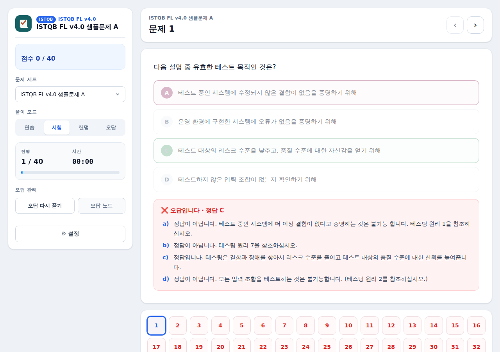
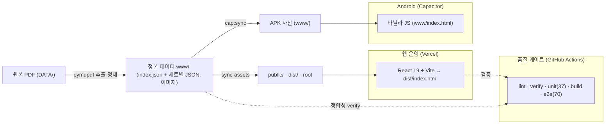

# ISTQB / CSTS 문제 풀이 앱


-yellow)


ISTQB Foundation Level v4.0 및 CSTS(SW 테스트 전문가) 한국어 문제를 태블릿·Android APK·웹에서 풀 수 있도록 만든 오프라인 문제 풀이 앱입니다.

## 하이라이트 (Quality Engineering)

> 1인 개발 프로젝트지만 **품질 보증(QA)** 에 무게를 둔 점이 특징입니다.

- **테스트 자동화 107개**: Vitest 유닛 37 + Playwright **E2E 70**(모드·문항유형·네비·설정·영속성·엣지·반응형·접근성). 전체 시나리오는 [`docs/e2e-test-scenarios.md`](docs/e2e-test-scenarios.md).
- **데이터 정합성 검증**: 626문항 정답·이미지·스키마를 `npm run verify` 로 자동 점검 + 전 문항 렌더 스윕(404·예외·깨진 이미지 0).
- **결함 RCA & 회귀 방지**: PDF 원본 ↔ 앱 렌더를 전수 대조해 결함을 찾고, 반복 결함의 근본원인을 분석해 클래스 단위로 차단(회귀 테스트 추가).
- **CI 품질 게이트**: GitHub Actions 5-job(lint·verify·unit·build·e2e) 통과 시에만 머지.
- 자세한 내용(QA 직무 정리)은 [`docs/PORTFOLIO.md`](docs/PORTFOLIO.md), 화면은 [`docs/screenshots/`](docs/screenshots/).



## 현재 포함된 문제

데이터는 `www/data/index.json`을 통해 세트 단위로 관리됩니다. (`schemaVersion: 1`)

### ISTQB FL v4.0 (5세트 · 186문항)

| 세트 | 문항 수 |
|------|---------|
| 샘플문제 A | 40 |
| 샘플문제 B | 40 |
| 샘플문제 C | 40 |
| 샘플문제 D | 40 |
| 샘플문제 모음(EXTRA) | 26 |

### CSTS (7세트 · 440문항)

| 세트 | 문항 수 |
|------|---------|
| CSTS 2402FL (공개답안) | 70 |
| CSTS 2403FL (공개답안) | 70 |
| CSTS 2404FL (공개답안) | 70 |
| CSTS 2405FL (공개답안) | 70 |
| 2018년도 예제(일반등급) | 20 |
| 2019년도 예제(일반등급) | 70 |
| SW 테스트 전문가 예제(정답포함) | 70 |

**총 12세트 · 626문항**이 포함되어 있습니다.

## 주요 기능

- ISTQB / CSTS 자격증 선택 → 세트 선택 → 풀이로 이어지는 진입 흐름
- 연습 모드, 시험 모드, 랜덤 모드, 오답 모드 지원
- 연습 모드에서는 답 선택 후 즉시 정답/해설 확인
- 시험/랜덤/오답 모드에서는 채점 후 결과 확인
- 오답 모드에서 `오답 다시풀기`를 누르기 전까지 기존 오답 기록 보호
- 문제 풀이 중 문제 세트나 모드 변경 시 확인 알림 표시
- 앱을 껐다 켜도 풀이 상태를 복원할 수 있도록 localStorage / IndexedDB에 저장
- 풀이 기록을 JSON 파일로 내보내기 / 가져오기 지원
- PDF에서 추출한 표·그림·코드 블록·목록을 이미지/구조화 블록으로 렌더링
- 다크모드 및 반응형(태블릿) 레이아웃 지원
- 문제 데이터 검증 스크립트(`scripts/validate-questions.js`) 제공

## 아키텍처

데이터 정본(`www/`)을 동기화로 배포 경로에 복사하고, 웹은 React(`dist`)·APK는 바닐라 JS(`www`)로 서빙하는 **이중 런타임** 구조입니다.



## 프로젝트 구조

이 저장소에는 **웹 운영 중인 React 앱**과 **APK·로컬·레거시 E2E 용도로 유지되는 바닐라 JS 앱**이 함께 존재합니다.

### 데이터 (공통)

- `www/data/index.json`: 세트 목록·메타 인덱스 (세트별 JSON 파일 경로 포함)
- `www/data/istqb/*.json`: ISTQB 세트별 문제 데이터
- `www/data/csts/*.json`: CSTS 세트별 문제 데이터
- `www/figures/`, `figures/`, `csts-figures/`: 문제에 필요한 그림 이미지
- 공통 스키마: 문제 식별자(`id`) 기반, `stem` / `options` / `explanation` 블록 구조

> 과거의 단일 `questions.json` / `questions.js` 구조는 제거되었습니다(Phase 2). 데이터는 위 세트별 JSON으로 분리되어 관리됩니다.

### ① React 앱 (운영 · Vercel 배포)

- 현재 **웹 운영 진입점**입니다. CBT(시험) 스타일 신규 디자인 적용.
- `index.vite.html`: Vite 엔트리 HTML (`#root`) — 빌드 시 산출물은 `dist/index.html`로 emit
- `src/main.tsx`, `src/app/App.tsx`: React 진입점
- `src/components/`, `src/features/`, `src/store/`, `src/hooks/`, `src/utils/`: 컴포넌트·상태·로더
- 스택: React 19 + TypeScript + Zustand + Vite + PWA(`vite-plugin-pwa`)
- `vite.config.ts`, `tsconfig.json`: 빌드 / 타입 설정
- `vercel.json`: Vercel 배포 설정(`framework: vite`, `buildCommand: npm run build`, `outputDirectory: dist`)

### ② 바닐라 JS 앱 (APK · 로컬 미리보기 · 레거시 E2E)

- 더 이상 웹 운영 진입점은 아니며, Capacitor APK·로컬 미리보기·레거시 E2E 용도로 유지됩니다.
- `www/index.html`: Capacitor APK용 앱 HTML
- `www/script.js`, `www/style.css`: 앱 로직 / 스타일
- `service-worker.js`, `www/service-worker.js`: 오프라인 캐시 설정 (루트 `service-worker.js`는 구 SW 자가 해제 tombstone)
- `index.html`: 루트 미리보기용 HTML
- `local-server.js`: 로컬 미리보기 서버

### Android / Capacitor

- `android/`: Capacitor Android 프로젝트
- `capacitor.config.json`: Capacitor 설정

### CI / 테스트

- `.github/workflows/ci.yml`: GitHub Actions CI (lint · 데이터 검증 · 유닛 테스트 · 빌드 · E2E)
- `eslint.config.mjs`: ESLint(flat config) 규칙 — `npm run lint`
- `vitest.config.ts`: 유닛 테스트(node·jsdom, 37개) — `npm test`, 커버리지 `npm run test:cov`
- `playwright.config.ts`: E2E(legacy·react) — `npm run test:e2e` (React 기능 E2E 70개)

### 문서

- `docs/commit-dashboard.html`: 커밋 · GitHub 이슈 대시보드
- `docs/e2e-test-scenarios.md`: React E2E 70개 시나리오(전제·행위·기대) 정리
- `docs/harness/`: 작업 하니스 관련 메모
- `APK_BUILD.md`: APK 빌드 메모
- `AGENTS.md`: 에이전트/기여 가이드

## 로컬 미리보기

### 바닐라 JS 앱

```powershell
npm install
npm run serve
```

브라우저에서 아래 주소를 엽니다.

```text
http://127.0.0.1:8080/
```

단순 확인은 `www/index.html`을 직접 열어도 가능하지만, 최종 동작 확인은 로컬 서버에서 보는 것을 권장합니다.

### React 앱 (개발 서버)

```powershell
npm install
npm run dev
```

Vite 개발 서버가 실행되며 `index.vite.html` 기준으로 React 앱을 미리볼 수 있습니다.

## 데이터 검증

문제 데이터(중복 id, 정답 유효성, 그림 파일 실존 등)를 검증합니다.

```powershell
npm run validate:questions
```

## 웹 빌드 (React / Vite)

```powershell
npm run build
```

`tsc` 타입 검사 후 `index.vite.html`을 엔트리로 `dist/`에 정적 빌드가 생성됩니다. 빌드 단계에서 산출물 HTML은 정적 호스팅 기본 라우팅과 PWA navigateFallback에 맞춰 `dist/index.html`로 emit됩니다(소스 파일명 `index.vite.html`은 유지).

> **배포 참고**: Vercel 운영 배포는 `buildCommand: "npm run build"`로 빌드 후 `outputDirectory: "dist"`(React 앱)를 서빙합니다. 즉 실제 운영 진입점은 `dist/index.html`(React 앱)입니다.
>
> 루트 `index.html` + `script.js`(바닐라 JS 앱)는 더 이상 Vercel 운영 진입점은 아니며, Capacitor APK(`www/`)·로컬 미리보기(`npm run serve`)·레거시 E2E 용도로 저장소에 유지됩니다.

## APK 빌드

필요한 프로그램:

- Node.js
- JDK 17 이상
- Android Studio 또는 Android SDK

빌드 순서:

```powershell
npm install
npm run cap:sync
cd android
.\gradlew.bat assembleDebug
```

빌드가 성공하면 APK가 생성됩니다.

```text
android/app/build/outputs/apk/debug/app-debug.apk
```

프로젝트 루트에 복사해 둔 배포용 debug APK 이름은 다음과 같습니다.

```text
ISTQB-FL-debug.apk
```

### Release APK 서명

정식 배포용 APK는 debug APK가 아니라 release 서명 APK를 사용합니다. 키스토어 파일과 비밀번호는 저장소에 커밋하지 말고 환경변수로만 전달합니다.

```powershell
$env:ISTQB_RELEASE_STORE_FILE="C:\path\to\istqb-release.jks"
$env:ISTQB_RELEASE_STORE_PASSWORD="키스토어 비밀번호"
$env:ISTQB_RELEASE_KEY_ALIAS="키 별칭"
$env:ISTQB_RELEASE_KEY_PASSWORD="키 비밀번호"
npm run cap:sync
npm run android:release
```

결과 파일:

```text
android/app/build/outputs/apk/release/app-release.apk
```

## Android SDK 경로

Gradle이 Android SDK를 찾지 못하면 `android/local.properties` 파일에 SDK 경로를 지정합니다.

```properties
sdk.dir=C\:\\Users\\PC\\AppData\\Local\\Android\\Sdk
```

`android/local.properties`는 로컬 환경 전용 파일이라 Git에는 포함하지 않습니다.

## Git 주의사항

APK, Gradle 빌드 결과물, Android SDK 로컬 설정은 Git에 포함하지 않습니다.

```text
node_modules/
android/**/build/
android/local.properties
*.apk
*.aab
*.jks
*.keystore
```

> 참고: Vite 빌드 산출물 `dist/`는 `.gitignore`로 추적하지 않습니다. Vercel이 배포 시 `npm run build`로 직접 생성하므로 저장소에 커밋할 필요가 없습니다.

## 라이선스 및 데이터 저작권

- **소스 코드**: MIT 라이선스 — [`LICENSE`](LICENSE).
- **문제(시험) 콘텐츠**: `DATA/`, `www/data/`, `public/data/` 및 figure 이미지는 **제3자 저작권물**입니다.
  - ISTQB® Foundation Level v4.0 샘플문제 — © ISTQB®
  - CSTS / SW 테스트 전문가 기출 — © 한국정보통신기술협회(TTA)
  - 개인 학습 목적 포함이며 **재배포·상업적 이용은 허용되지 않습니다.**

### 데모 / 배포 정책
시험 콘텐츠 저작권상 **전체 콘텐츠를 공개 라이브로 호스팅하지 않습니다.** 포트폴리오 데모는 다음으로 대체합니다(안전 순):
1. **스크린샷** — [`docs/screenshots/`](docs/screenshots/) (권장)
2. **로컬/비공개 데모** — `npm run serve`(로컬) 또는 암호 보호 호스팅
3. **모의문항 데모** — 데이터를 자작 샘플 문항으로 교체 시 공개 라이브도 가능

포트폴리오 정리는 [`docs/PORTFOLIO.md`](docs/PORTFOLIO.md)(QA 직무 중심) 참고.

앱 변경 후 APK를 다시 만들 때는 `www/`와 루트 파일이 동기화되어 있는지 확인한 뒤 `npm run cap:sync`를 실행하세요.
